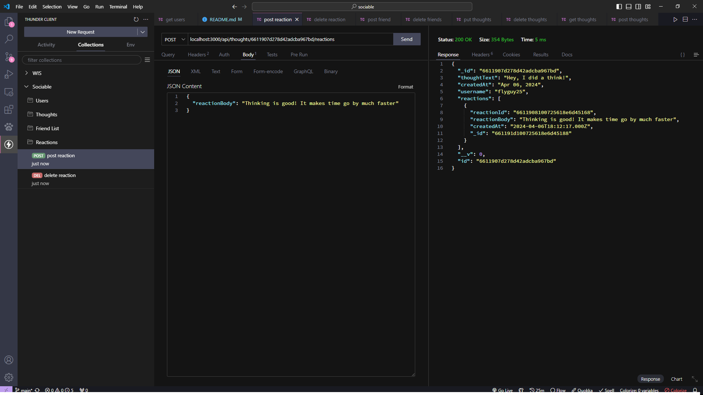

# Sociable
Sociable is a simple to use RESTful API for a generic social media platform.
It uses Mongooose and MonogDB fully as the backbone of the database and Express for the server.

## Installation
The installation for the app if simple:
- run `npm i` to install the necessary node packages.
- run `node seeders/index.js` to seed the database with filler data, or modify the seed data in the `seeds` folder with your data.
- run `npm start` to start the server.

## Tests
Below are some images of some endpoint tests for getting and inserting data into each section of the database:

## Users Requests  
  
### GET
path: `/api/users`
  
  
### POST
path: `/api/users`

## Thoughts Requests  
  
### GET
path: `/api/thoughts`
  
  
### POST
path `/api/thoughts`

## Friends Requests
  
### POST
path: `api/users/:userId/friends/:friendId`

  
### DELETE
path: `api/users/:userId/friends/:friendId`

## Reactions Requests
  
### POST
path: `/api/thoughts/:thoughtId/reactions`

  
### DELETE
path: `/api/thoughts/:thoughtId/reactions/:reactionId`
